# Handbuch — wie dieser Code funktioniert

Dieses Dokument erklärt die **Funktionsweise** der Codebasis: Wie die Bausteine
zusammenhängen, in welcher Reihenfolge sie arbeiten, warum sie so gebaut sind
und wo die methodisch heiklen Stellen sitzen.

- Was das Projekt *ist* und wie man es *startet* → [README.md](README.md)
- Schritt-für-Schritt-Bedienung ohne Programmiervorkenntnisse → [ANLEITUNG.md](ANLEITUNG.md)
- Wissenschaftliche Grenzen und Literatur → [LIMITATIONS.md](LIMITATIONS.md)

Der Code selbst ist durchgehend laienverständlich kommentiert; dieses Handbuch
ergänzt die Vogelperspektive, die man in einzelnen Dateien nicht sieht.

---

## Inhalt

1. [Die Fragestellung in 60 Sekunden](#1-die-fragestellung-in-60-sekunden)
2. [Architektur: Schichten und Abhängigkeiten](#2-architektur-schichten-und-abhängigkeiten)
3. [Der Gesamtablauf eines Laufs](#3-der-gesamtablauf-eines-laufs)
4. [Die Datenpipeline](#4-die-datenpipeline)
5. [Die Backtest-Hauptschleife](#5-die-backtest-hauptschleife)
6. [Die vier Strategien](#6-die-vier-strategien)
7. [Look-Ahead-Schutz: drei Sicherungen](#7-look-ahead-schutz-drei-sicherungen)
8. [Purged und Embargoed Cross-Validation](#8-purged-und-embargoed-cross-validation)
9. [Drift, Turnover und Transaktionskosten](#9-drift-turnover-und-transaktionskosten)
10. [Kennzahlen](#10-kennzahlen)
11. [Die Signifikanzanalyse](#11-die-signifikanzanalyse)
12. [Konfiguration und Reproduzierbarkeit](#12-konfiguration-und-reproduzierbarkeit)
13. [Ausgaben](#13-ausgaben)
14. [Tests](#14-tests)
15. [Erweitern: wo hängt man was ein?](#15-erweitern-wo-hängt-man-was-ein)
16. [Stolperfallen](#16-stolperfallen)

---

## 1. Die Fragestellung in 60 Sekunden

Vier Rezepte verteilen Geld auf 15 US-Aktien. Jeden Monatsletzten dürfen sie ihr
Depot neu mischen — aber nur mit Wissen, das zu diesem Zeitpunkt existierte.

| Strategie | Was sie schätzt | Wie sie gewichtet |
|---|---|---|
| **Markowitz MVO** | historische Durchschnittsrenditen | Sharpe-Maximierung |
| **Random Forest** | KI-Prognose der Folgemonatsrendite | dieselbe Sharpe-Maximierung |
| **Equal Weight** | nichts | stur 1/15 je Titel |
| **Risk Parity** | nur die Kovarianzmatrix | gleicher Risikobeitrag je Titel |

Der Vergleich **Markowitz ↔ Random Forest** ist bewusst als *ceteris paribus*
angelegt: Beide benutzen dieselbe Kovarianzmatrix, denselben Optimierer,
dieselbe Positionsobergrenze und dasselbe Turnover-Limit. Der **einzige**
Unterschied ist der Renditeschätzer. Das ist der methodische Kern der Arbeit —
und der Grund für mehrere Optionen, die in [§ 6](#6-die-vier-strategien) und
[§ 9](#9-drift-turnover-und-transaktionskosten) erklärt werden.

Am Ende steht nicht „welche Strategie gewinnt?", sondern: **Ist der Unterschied
statistisch überhaupt von Zufall unterscheidbar?** Die Antwort lautet für fünf
von sechs Paarvergleichen: nein.

---

## 2. Architektur: Schichten und Abhängigkeiten

Die Module sind in vier Schichten geordnet. Jede Schicht darf nur nach *unten*
importieren — dadurch gibt es keine Import-Zyklen, und jedes Modul lässt sich
isoliert testen.

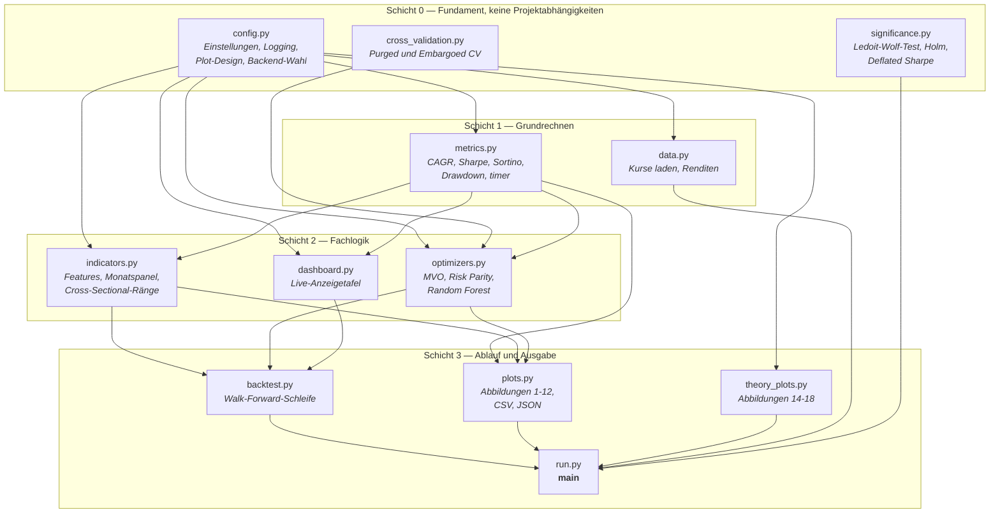

**Warum `config.py` ganz unten steht:** Es ist die einzige Datei ohne
projektinterne Importe. Alle anderen holen sich mit `from .config import *`
sowohl die Einstellungen als auch das Logbuch `log` und die Farbtabelle
`COLORS`. Dadurch existiert genau *eine* Wahrheit über jeden Parameter — die
Instanz `CFG`, die beim ersten Import einmalig entsteht.

**Warum `cross_validation.py` und `significance.py` Schicht 0 sind:** Sie
benutzen nur numpy/pandas/scipy und nichts aus dem Projekt. Das macht sie
wiederverwendbar und, wichtiger, ohne Backtest testbar — die 12 Tests dafür
laufen in Millisekunden.

---

## 3. Der Gesamtablauf eines Laufs

`python -m portfolio` führt `__main__.py` aus, das `main()` aus `run.py` startet.
`main()` ist im Code mit den Buchstaben **A–I** durchnummeriert:

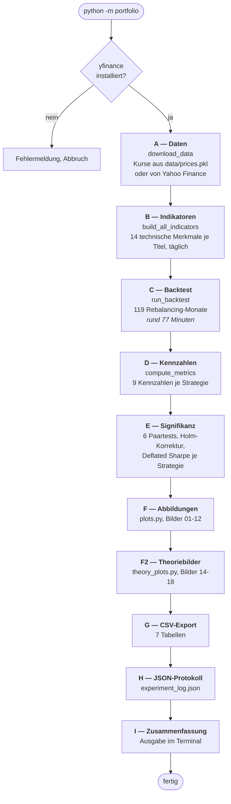

Nur die Abschnitte **A**, **C** und **E** kosten nennenswert Zeit, und **C**
dominiert mit Abstand. Gemessen am maßgeblichen Lauf: 4619 der 4636 Sekunden
entfallen auf den Backtest, davon **4546 Sekunden allein auf
`fit_with_tuning`** — also 98 % der Rechenzeit auf die
RF-Hyperparametersuche, im Schnitt 38 Sekunden je Monat.

Die Reihenfolge ist nicht beliebig — **E vor H**, weil das JSON-Protokoll die
Signifikanzergebnisse mitschreibt, und **C vor F**, weil die Abbildungen die
Momentaufnahmen des letzten Backtest-Monats brauchen (`w_mvo_last`, `cov_ann`,
`frontier_snapshots`).

---

## 4. Die Datenpipeline

Aus Kursen werden Merkmale. Der Weg dahin hat fünf Stationen:

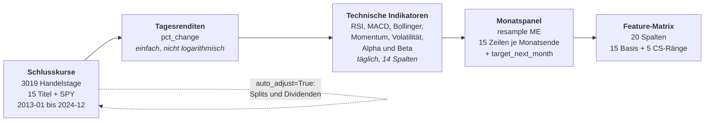

### Warum einfache statt logarithmischer Renditen

Die Portfoliorendite ist die **gewichtete Summe** der Titelrenditen:
`r_p = Σ wᵢ · rᵢ`. Das gilt exakt nur für einfache Renditen. Log-Renditen sind
über die *Zeit* additiv, aber nicht über *Titel* — ihre gewichtete Summe ergäbe
keine gültige Portfoliorendite und wäre inkonsistent zu `(1+r).cumprod()` in der
Kennzahlberechnung. `data.py` dokumentiert das ausdrücklich.

Umgekehrt sind einfache Renditen über die Zeit **multiplikativ**. Deshalb
zinst `aggregate_to_monthly` die Monatsrendite mit `(1+r).resample("ME").prod()-1`
auf und addiert sie nicht: +10 % gefolgt von −10 % ergibt −1 %, nicht 0 %.

### Wie aus Tageswerten Monatswerte werden

Zwei Aggregationsregeln, je nach Natur des Merkmals:

| Regel | Merkmale | Begründung |
|---|---|---|
| **Endwert** (`.last()`) | RSI, MACD ×3, Bollinger ×2, Alpha, Beta | Momentaufnahmen — es zählt der Zustand am Monatsende |
| **Durchschnitt** (`.mean()`) | Momentum ×4, Volatilität ×2 | Niveaugrößen — der Monatsmittelwert ist stabiler als ein Stichtag |

### Cross-Sectional-Ränge

`add_cross_sectional_ranks` ergänzt fünf Spalten. Statt „Apple hat Momentum
+8 %" lernt das Modell zusätzlich „Apple hat diesen Monat den drittbesten
Momentum-Wert der 15 Titel" — als Perzentil zwischen 0 und 1, vergeben
`groupby(level=0)`, also **innerhalb** jedes Monats. Relative Ränge sind über
Marktphasen hinweg stabiler vergleichbar als absolute Werte; +8 % kann 2017 viel
und 2020 wenig sein (Jegadeesh & Titman 1993).

Gerangt werden `rsi`, `mom_21d`, `mom_63d`, `mom_252d`, `alpha_spy` — festgelegt
in `RANK_COLS` (`config.py`), bewusst *nicht* über `config.json` einstellbar,
weil sie zur Struktur des Modells gehören und nicht zu seinen Stellschrauben.

**Ergebnis:** `FEATURE_COLS` = 15 Basis-Merkmale + 5 Rangmerkmale = **20 Spalten**.

### Der Kursspeicher

`data/prices.pkl` friert den Download vom 15.08.2026 ein. Grund: Yahoo liefert
bei zwei Abrufen im Abstand weniger Minuten **nicht** dieselben Kurse — gemessen
wichen 36 553 von 45 285 Werten ab, relativ bis 1,3·10⁻⁶. Winzig, aber es ist
die *Eingangsgröße*; über Kovarianzschätzung und Optimierer schlägt sie bis in
die Kennzahlen durch. Ein Backtest, dessen Rohdaten sich unter der Hand ändern,
ist nicht reproduzierbar.

---

## 5. Die Backtest-Hauptschleife

`run_backtest()` in `backtest.py` ist das Herzstück. Ein Schleifendurchlauf =
ein Rebalancing-Monat. Die Liste `backtest_months` hat 120 Einträge; iteriert
wird über `[:-1]`, also **119 Durchläufe** — auf den letzten Monat folgt keine
Halteperiode mehr, deren Rendite man messen könnte.

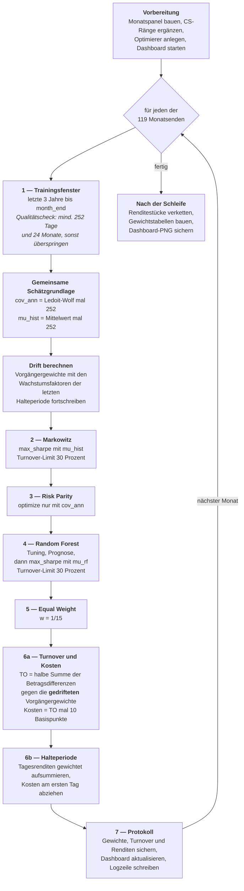

### Was in einem Schritt tatsächlich passiert

Am Beispiel des zweiten Termins, 28.02.2015:

| Schritt | Konkret |
|---|---|
| Trainingsfenster | 28.02.2012 bis 28.02.2015 — vorhanden sind aber erst Daten ab 01.01.2013, also faktisch rund 25 Monate |
| Kovarianz | Ledoit-Wolf über rund 540 Tagesrenditen, 15×15-Matrix, mit 252 annualisiert |
| Halteperiode | 02.03.2015 bis 31.03.2015, rund 22 Handelstage |
| MVO-Turnover | 26,4 % — unter dem Limit |
| RF-Turnover | 30,0 % — Limit greift, wie in 101 der 118 regulären Monate |
| Schrittdauer | 14,1 Sekunden, davon 13,3 s Hyperparametersuche |

Die ersten Termine arbeiten also mit einem **kürzeren** Fenster als drei Jahre,
weil die Kursdaten erst 2013 beginnen. Ab Februar 2016 ist das Fenster voll.

### Rückgabe

`run_backtest` gibt ein `dict` zurück. Die Einträge mit `_last` sowie `mu_hist`,
`mu_rf` und `cov_ann` stammen aus dem **letzten** Durchlauf — sie sind
Momentaufnahmen für die Effizienzlinien-Abbildungen, keine Zeitreihen:

```
returns  weights_mvo  weights_rf  weights_rp  turnover_df
mu_hist  mu_rf  cov_ann  w_mvo_last  w_rf_last  w_rp_last
frontier_snapshots   rfo
```

`rfo` ist das Optimierer-**Objekt** selbst, weiterverwendet für die
Feature-Importance (Abbildung 7) und die SHAP-Analyse (Abbildung 12).

### Sicherheitsnetze

Jeder Optimiererblock steckt in `try/except`. Scheitert ein Optimierer in einem
einzelnen Monat — etwa weil SLSQP nicht konvergiert —, weicht die Strategie für
diesen Monat auf 1/N aus, der Vorfall wandert ins Log, und der Backtest läuft
weiter. Ein Abbruch nach 90 Minuten wegen eines einzelnen Ausreißers wäre die
schlechtere Alternative. Der Frontier-Snapshot fängt sogar stillschweigend ab
(`except Exception: pass`) — er beeinflusst ausschließlich Abbildungen.

---

## 6. Die vier Strategien

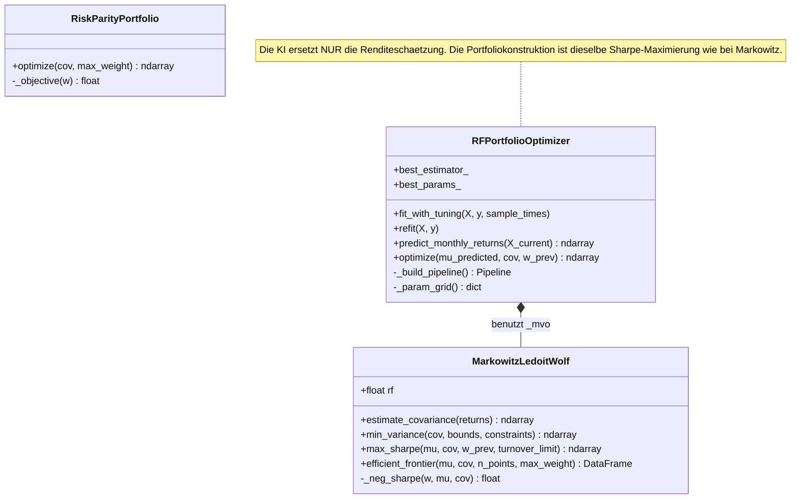

### Markowitz MVO

Zwei Zutaten, ein Löser:

- **Kovarianz** per `LedoitWolf().fit()`, mit 252 annualisiert. Ledoit-Wolf
  „schrumpft" die verrauschte Stichprobenkovarianz in Richtung einer stabilen
  Zielmatrix. Bei 15 Titeln und drei Jahren Daten ist das kein Luxus: Markowitz
  gilt als *error maximizer*, er verstärkt Schätzfehler systematisch.
- **Erwartete Renditen** als schlichter historischer Mittelwert × 252.
- **Optimierung**: `scipy.optimize.minimize(method="SLSQP")` minimiert die
  *negative* Sharpe Ratio — der Minus-Trick, weil `minimize` nur minimieren kann.

Nebenbedingungen: `Σw = 1` (Gleichung), `0 ≤ wᵢ ≤ 0,20` (Schranken), optional
`Limit − ½·Σ|w − w_prev| ≥ 0` (Ungleichung, Turnover).

**Der entartete Fall.** Die Sharpe Ratio ist `(μ_p − r_f)/σ_p`. Ist der Zähler
negativ — kein zulässiges Portfolio erwartet mehr als der risikofreie Zins —,
macht ein *größeres* σ_p im Nenner den Bruch *weniger* negativ. Der Optimierer
würde dann das Risiko **maximieren**. Ökonomisch Unsinn:

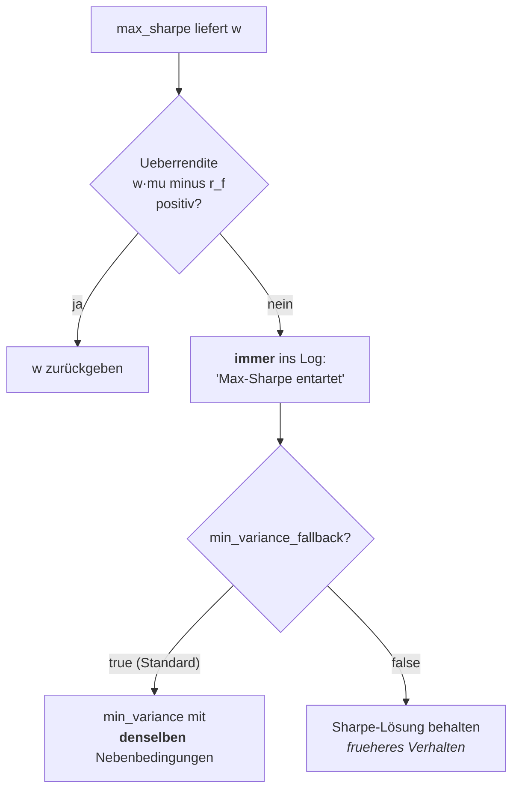

Die Warnung wird **immer** geschrieben, auch bei abgeschalteter Option — nur so
lässt sich im Protokoll nachzählen, wie oft der Fall auftrat. Im maßgeblichen
Lauf: **null von 119 Monaten**. Die Option ist reine Vorsorge und wurde per Test
(`test_max_sharpe_degenerate_falls_back_to_min_variance`) auf einem
konstruierten Fall abgesichert.

### Risk Parity (ERC)

Zielfunktion: die Streuung der Risikobeiträge minimieren.

```
RCᵢ = wᵢ · (Σw)ᵢ / √(wᵀΣw)        Ziel: RCᵢ = √(wᵀΣw)/n für alle i
minimiere Σᵢ (RCᵢ − Zielbeitrag)²
```

Braucht **keine Renditeprognose** — nur die Kovarianzmatrix. Das macht die
Strategie robust gegen die notorisch unsicheren Renditeschätzungen und ist
zugleich der Grund, warum sie im Backtest die niedrigste Volatilität *und* die
niedrigste Rendite hat: Sie kauft Stabilität mit Renditeverzicht.

Untergrenze `0,005` statt `0`: hält jeden Titel minimal vertreten und verhindert,
dass SLSQP in der Ecke `w = 0` festhängt.

### Random Forest

Drei Phasen, sauber getrennt:

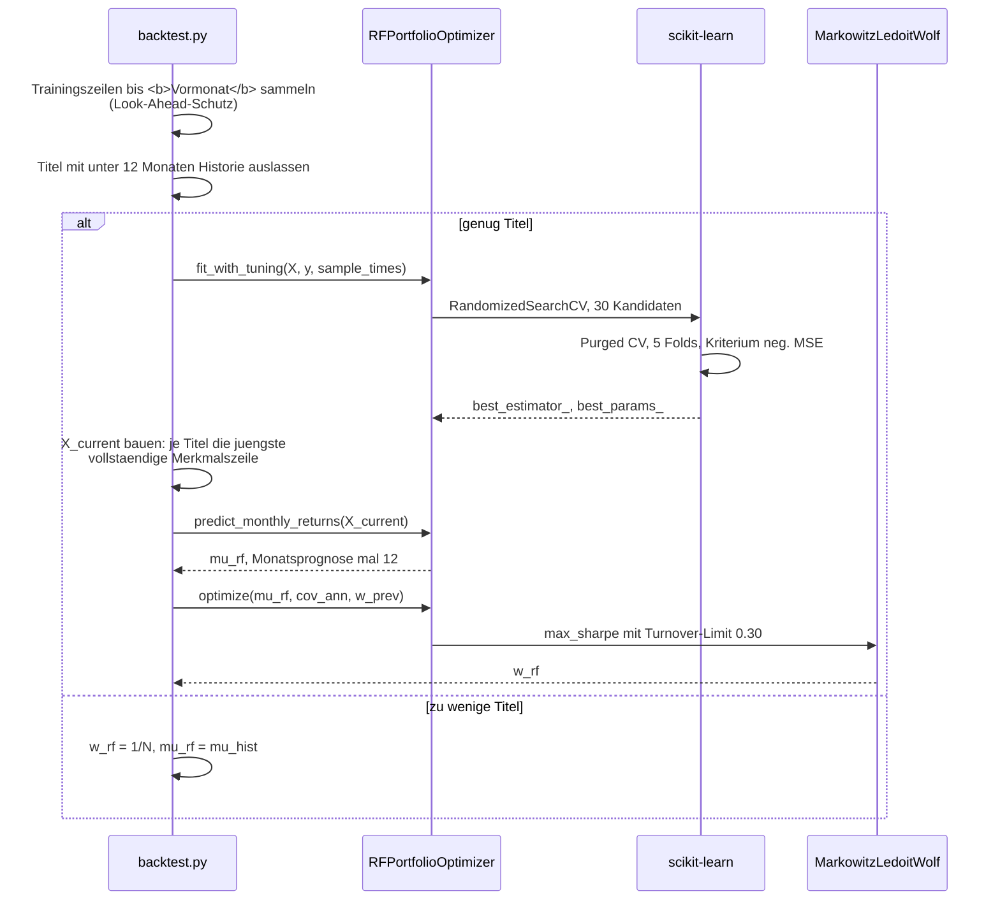

**Gepooltes Modell:** Ein einziger Wald lernt über *alle* Titel hinweg. Die
Trainingszeilen aller 15 Aktien werden gestapelt (`pd.concat`), damit das Modell
titelübergreifende Muster findet. Je Titel stehen nur rund drei Dutzend
Monatszeilen zur Verfügung — ein Modell *pro* Aktie wäre hoffnungslos datenarm.
Gepoolt ergibt das (gemessen mit `nachrechnen_kapitel3.py`):

| Größe | Wert |
|---|---|
| Trainingszeilen je Termin | Median **525** = 15 Titel × 35 Monate |
| Spanne über alle 119 Termine | 180 bis 540 |
| Merkmale | 20 |
| Verhältnis Zeilen zu Merkmalen | rund 26 : 1 |

**Was die Hyperparametersuche daraus macht, ist aufschlussreich:** Sie wählt in
**82 % der Monate die Baumtiefe 3** — den *unteren Rand* des Suchraums (3 bis
14). Median 3, in 86 % der Monate höchstens 5. Bei 525 Zeilen und Tiefe 3 sitzen
rund 66 Beobachtungen in jedem der maximal acht Blätter. Die Kreuzvalidierung
drängt das Modell also mit aller Kraft in Richtung *Einfachheit* — ein
unabhängiges Indiz dafür, dass in den Merkmalen wenig verwertbares Signal steckt.
Das passt zum Gesamtbefund der Arbeit: Der Random Forest schlägt 1/N nicht
signifikant.

**Pipeline:** `StandardScaler` → `RandomForestRegressor`. Der Scaler ist für
Bäume theoretisch entbehrlich, hält die Kette aber sauber und robust gegen
spätere Modellwechsel. Der Suchraum: `n_estimators` 100–499, `max_depth` 3–14,
`min_samples_leaf` 3–19, `max_features` 30–90 %, `max_samples` 60–95 %.
(`randint(a, b)` zieht aus [a, b), die obere Grenze ist also exklusiv — deshalb
14 und nicht 15.)

**Annualisierung:** `predict_monthly_returns` multipliziert die Monatsprognose
mit 12, weil der nachgelagerte Optimierer mit annualisierten Größen rechnet —
`mu_hist` (×252 aus Tagesdaten) und `cov_ann` (×252) leben auf derselben Skala.

**`refit()`** ist der Sparmodus: übernimmt die zuletzt gefundenen Hyperparameter
und passt nur das Modell ans neue Fenster an. Aktiv, sobald
`rf_retune_every > 1`. Im maßgeblichen Lauf **nicht** benutzt (`= 1`).

### Equal Weight

`np.ones(n)/n`. Kein Optimierer, kein Objekt, keine Schätzung. Genau das ist der
Punkt: DeMiguel, Garlappi & Uppal (2009) zeigten, dass 1/N vieles schlägt, was
deutlich mehr Aufwand treibt. Diese Codebasis reproduziert den Befund.

---

## 7. Look-Ahead-Schutz: drei Sicherungen

„Look-Ahead-Bias" heißt: Wissen aus der Zukunft sickert in eine
Vergangenheitsentscheidung. Daran scheitern die meisten unsauberen Backtests.
Hier greifen drei unabhängige Sicherungen.

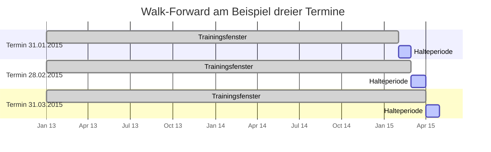

**Sicherung 1 — das Fenster.** Alle Trainingsdaten werden mit
`asset_returns.index <= month_end` beschnitten. Kein Optimierer sieht je einen
Kurs nach dem Entscheidungstag.

**Sicherung 2 — der ausgelassene Vormonat.** Das Label `target_next_month` eines
Monats *t* ist die Rendite von *t+1*. Bliebe der letzte Trainingsmonat drin,
wäre sein Label genau die Rendite, die gleich prognostiziert werden soll — die
Lösung stünde im Trainingsmaterial. Deshalb:

```python
last_train_month = month_end - pd.DateOffset(months=1)
t_rows = train_monthly[... & (train_monthly.index <= last_train_month)]
```

Abgesichert durch `test_target_is_next_month_and_last_is_nan`.

**Sicherung 3 — Purging und Embargo in der Kreuzvalidierung.** Siehe
[§ 8](#8-purged-und-embargoed-cross-validation).

Und eine vierte, oft übersehene: Die **Halteperiode** beginnt strikt *nach* dem
Rebalancing-Tag (`index > month_end`). Die Rendite des Entscheidungstags selbst
zählt nicht mit — sonst würde am Stichtag zu bereits bekannten Kursen gehandelt.

---

## 8. Purged und Embargoed Cross-Validation

`TimeSeriesSplit` verhindert, dass Testdaten *vor* den Trainingsdaten liegen.
Das reicht hier nicht. Zwei Lecks bleiben:

1. Die Merkmale stammen aus **überlappenden Fenstern** — Momentum über 252 Tage,
   rollierendes Alpha/Beta über 63 Tage. Benachbarte Monate teilen also
   buchstäblich dieselben Kurstage.
2. Das **Label reicht in den Folgemonat**. Der Trainingsmonat direkt vor dem
   Testblock hat als Label die Rendite des ersten Testmonats.

`purged_kfold_splits()` legt deshalb zwei Sicherheitsabstände um jeden Testblock:

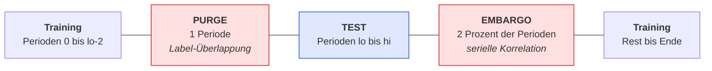

Die Perioden in PURGE und EMBARGO werden schlicht weggelassen — lieber etwas
weniger Trainingsmaterial als ein geschöntes Testergebnis.

**Panel-Fähigkeit** ist der zweite Kniff. Pro Monatsende gibt es 15 Zeilen, eine
je Titel. Gesplittet wird nach **Perioden**, nicht nach Zeilen: Nie landet ein
Teil der Titel eines Monats im Training und ein anderer im Test. Umgesetzt über
`row_pos`, das jeder Zeile ihre Periodennummer zuordnet.

**Was der Unterschied ausmacht:** Mit `use_purged_cv = false` erscheint der
Random Forest um rund **0,044 Sharpe besser**, als er ist. Das ist keine
Rundungsfrage — es ist größer als sein gesamter (insignifikanter) Vorsprung von
0,035 gegenüber Equal Weight.

Referenz: López de Prado (2018), *Advances in Financial Machine Learning*, Kap. 7.

---

## 9. Drift, Turnover und Transaktionskosten

Die subtilste Stelle des ganzen Codes.

**Das Problem.** Auch ohne einen einzigen Trade verschieben sich Depotgewichte:
Steigt NVIDIA um 20 % und Coca-Cola um 1 %, ist der NVIDIA-Anteil am Monatsende
größer als am Anfang. Das ist die **Kursdrift**. Wer den Turnover gegen die
*ursprünglichen Zielgewichte* misst, vergleicht mit einem Depot, das so nie
existiert hat.

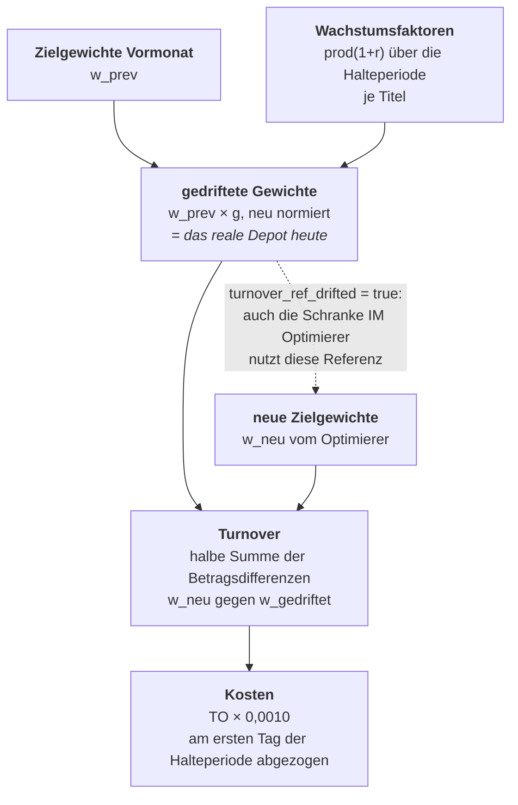

Drei Konsequenzen, alle im Code umgesetzt:

**1. Equal Weight bekommt endlich einen echten Turnover.** Gegen ungedriftete
Gewichte gemessen wäre er exakt 0 — 1/N gegen 1/N. Tatsächlich muss die
Strategie die Drift jeden Monat zurückführen. Gemessen: **Median 2,0 %** über die 118 regulären Termine.

**2. Die Turnover-Schranke greift dort, wo sie gemeint ist.** Bis zur Umstellung
maß die Schranke *im Optimierer* gegen ungedriftete Zielgewichte, die
*ausgewiesene* Messung aber gegen gedriftete. Der realisierte Turnover konnte
das nominelle Limit überschreiten — beim Random Forest in **100 von 118
Monaten**. Mit `turnover_ref_drifted = true` benutzen beide dieselbe Referenz.

**3. Beide aktiven Strategien spielen nach denselben Regeln.** Früher hatte nur
der Random Forest ein Limit. Damit unterschieden sich MVO und RF in *zwei*
Punkten — Renditeschätzer **und** Handelsrestriktion — statt in einem. Seit
`mvo_turnover_limit = 0.30` ist der Vergleich wirklich *ceteris paribus*.

**Der erste Monat** ist ein Sonderfall: `turnover = 1.0` für alle vier
Strategien, weil das Depot erst aufgebaut wird (100 % Kaufumsatz). Deshalb steht
in `turnover.csv` bei jeder Strategie ein Maximum von 1,000.

**Kosten gehen nicht in die Optimierung ein.** Sie werden nachträglich vom ersten
Tag der Halteperiode abgezogen. Gewichte und Umschlag sind damit vom Kostensatz
*unabhängig* — und genau deshalb kann `kosten_sensitivitaet.py` die Kennzahlen
für jeden anderen Satz exakt zurückrechnen, ohne den Backtest zu wiederholen.

**Beobachteter Turnover im maßgeblichen Lauf:**

Ohne den ersten Monat, der mit 100 % Kaufumsatz ein Sonderfall ist
(118 reguläre Termine):

| Strategie | Median | Mittel | am 30-%-Limit | Auffälligkeit |
|---|---:|---:|---:|---|
| Random Forest | 30,0 % | 29,0 % | 101 Monate | Limit greift fast durchgehend |
| Markowitz MVO | 11,9 % | 13,1 % | 1 Monat | Limit greift praktisch nie |
| Equal Weight | 2,0 % | 2,1 % | — | reine Driftrückführung |
| Risk Parity | 1,9 % | 2,0 % | — | Kovarianzen ändern sich langsam |

Das ist ein Ergebnis für sich: Der Random Forest **will** in fast jedem Monat
mehr umschichten, als er darf. Seine Prognosen schwanken von Monat zu Monat
stark — ohne die Schranke fräßen die Handelskosten den Prognosevorteil auf.

---

## 10. Kennzahlen

`compute_metrics()` verdichtet jede Renditespalte zu neun Zahlen.

| Kennzahl | Formel | Risikomaß im Nenner |
|---|---|---|
| CAGR | `(1+r).prod()^(252/T) − 1` | — |
| Annualisierte Vola | `std(r) · √252` | — |
| **Sharpe** | `mean(d)/std(d) · √252`, `d = r − r_f/252` | Gesamtvolatilität |
| Sortino | `mean(d)·252 / DD` | nur Abwärtsabweichung |
| Calmar | `CAGR / abs(MaxDD)` | schlimmster Absturz |
| Max. Drawdown | `min((cum − cummax)/cummax)` | — |
| VaR 95 % | 5. Perzentil der Tagesrenditen | — |
| Hit Rate | Anteil Tage mit `r > 0` | — |

Zwei Definitionen wurden am 15.08.2026 auf die Lehrbuchform gebracht — beides
sind Korrekturen, keine Geschmacksfragen:

**Sharpe arithmetisch statt geometrisch.** Frühere Fassungen setzten die CAGR in
den Zähler. Das mischt ein geometrisches Maß mit einem linear annualisierten
Nenner, entspricht nicht Sharpe (1994) — und lieferte für dieselbe Strategie
einen *anderen* Wert als `significance.py`, das schon immer arithmetisch rechnet.
Zwei Zahlen für dieselbe Größe in derselben Arbeit sind indiskutabel.

**Sortino mittelt über alle Tage.** Die Downside-Abweichung ist
`√( 1/T · Σ min(d_t, 0)² )` — Tage über der Zielrendite gehen mit 0 ein. Früher
stand dort die Standardabweichung *innerhalb* der Verlusttage; das misst die
Streuung unter den Verlusten statt deren Größe. Test:
`test_sortino_uses_all_days_not_only_losers`.

Ein wiederkehrendes Muster: `return … if sd > _EPS else 0.0` mit
`_EPS = 1e-12`. Kein kosmetischer Schutz — bei konstanten Renditen erzeugt die
Subtraktion `r_f/252` Gleitkommarauschen der Größenordnung 1e-20, und ohne
Toleranz käme `1e+16` heraus statt der gewollten 0.

---

## 11. Die Signifikanzanalyse

Abschnitt E von `main()`. Der wissenschaftliche Kern der Arbeit.

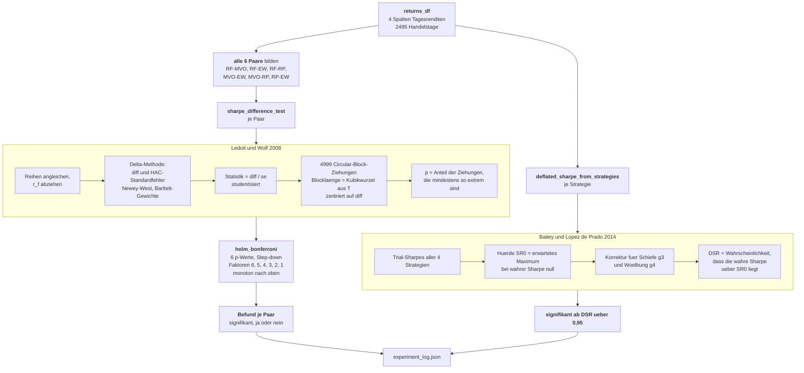

### Warum genau diese drei Verfahren

**Ledoit & Wolf (2008)** statt eines naiven i.i.d.-Bootstraps: Börsenrenditen
sind autokorreliert und clustern in ruhigen und turbulenten Phasen. Einzelne Tage
zu mischen zerstört diese Struktur und liefert zu enge Konfidenzbänder — der Test
würde zu oft „signifikant" sagen. Der Circular-Block-Bootstrap zieht
zusammenhängende Blöcke der Länge ∛T und läuft am Datenende nahtlos zum Anfang
über, damit jeder Tag gleich oft gezogen werden kann.

*Studentisiert* heißt: Verglichen wird nicht die rohe Differenz, sondern
Differenz ÷ Standardfehler. Der Standardfehler kommt aus der Delta-Methode über
den Momentvektor `(a, b, a², b²)` mit HAC-Kovarianz nach Newey-West — genau der
Punkt, der den Test robust macht.

**Alle sechs Paare, nicht fünf.** Welche Vergleiche man rechnet, wäre sonst ein
Freiheitsgrad des Auswertenden — genau das, wovor Harvey, Liu & Zhu (2016)
warnen. Mit sechs statt fünf Tests wird die Holm-Korrektur zudem strenger, das
Ergebnis also konservativer. Der Code kommentiert das ausdrücklich.

**Holm statt Bonferroni.** Gleicher Schutz vor Zufallstreffern, aber
trennschärfer: p-Werte aufsteigend sortieren, den kleinsten mit 6, den
zweitkleinsten mit 5 multiplizieren und so weiter. Das laufende Maximum sichert
die Monotonie.

**Deflated Sharpe Ratio.** Beantwortet eine andere Frage als die Paartests: nicht
„unterscheiden sich A und B?", sondern „ist die Sharpe von A überhaupt mehr als
Auswahlglück unter N Versuchen?". Im maßgeblichen Lauf liegt die Hürde SR₀ bei
0,067 annualisiert — alle vier Strategien überspringen sie klar (DSR > 0,98).

### Der entartete Bootstrap-Fall

Sind zwei Reihen identisch oder deterministisch verknüpft, ist der
Standardfehler 0 und der Bootstrap nicht definiert. Statt `nan` zurückzugeben,
entscheidet der Code eindeutig: identisch → `p = 1`, sonst → `p = 0`. Abgesichert
durch `test_sharpe_test_identical_series_degenerate`.

---

## 12. Konfiguration und Reproduzierbarkeit

### Wie ein Parameter seinen Wert bekommt

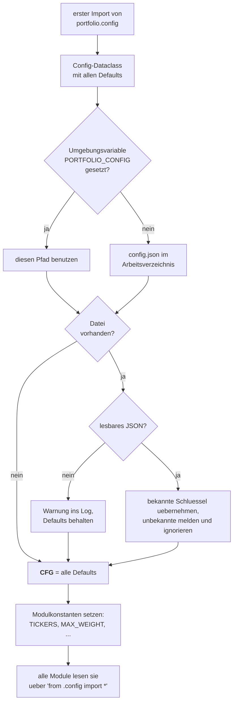

Die Auflösung passiert **einmal beim Import**, vor allem anderen. Deshalb wirkt
sie projektweit, ohne dass ein einziger Parameter durch die Funktionsaufrufe
gereicht werden müsste.

Die Großbuchstaben-Konstanten (`TICKERS`, `MAX_WEIGHT`, …) sind historisch
gewachsen und zeigen heute schlicht auf die `CFG`-Felder. Wer neue Parameter
ergänzt, sollte **beides** anlegen: das Dataclass-Feld *und* die Konstante.

### Drei Ebenen der Reproduzierbarkeit

| Ebene | Bedrohung | Maßnahme |
|---|---|---|
| **Rohdaten** | Yahoo liefert bei jedem Abruf minimal andere Kurse | `data/prices.pkl` friert den Abruf vom 15.08.2026 ein |
| **Modell** | `n_jobs=-1` summiert Teilergebnisse in wechselnder Reihenfolge; Gleitkommaaddition ist nicht assoziativ | `deterministic = true` erzwingt `n_jobs=1` in Wald **und** Suche |
| **Zufall** | Bootstrap, RandomizedSearch, Stichprobe in Abbildung 15 | überall fester Seed 42 |

Die mittlere Ebene ist die überraschende: `random_state=42` allein genügt
**nicht**. Bei paralleler Reduktion kürte die Hyperparametersuche in **4 von 119
Monaten** einen anderen Sieger unter nahezu gleichwertigen Kandidaten und
verschob den RF-Sharpe um rund 0,010. Das kostet Laufzeit — 77 statt rund 25
Minuten — und kauft bitgenaue Wiederholbarkeit. Ausführlich: LIMITATIONS.md § 12.

---

## 13. Ausgaben

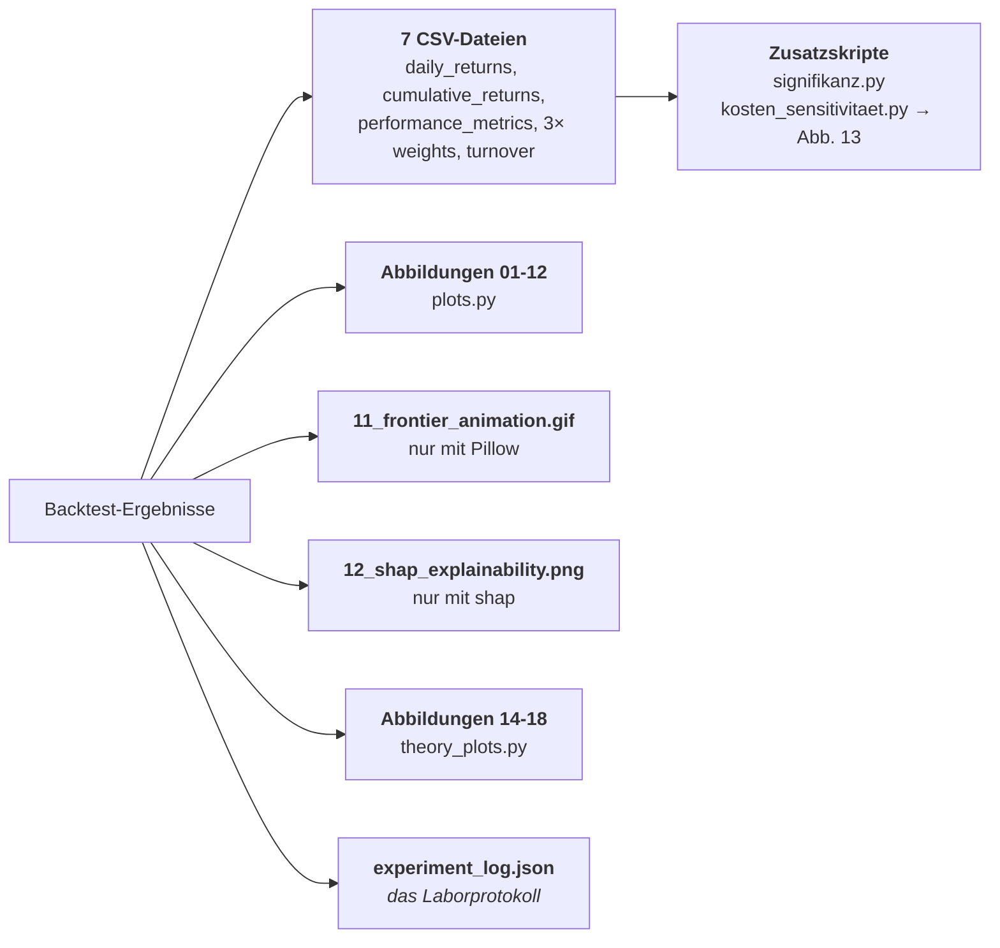

**`experiment_log.json` ist die maßgebliche Quelle** für jede Zahl der Arbeit.
Es enthält Zeitstempel, sämtliche Parameter (inklusive der fünf
Methodikoptionen), die vollständige Feature-Liste, alle Kennzahlen und alle
Signifikanzergebnisse. Wer später fragt „mit welchen Einstellungen genau ist
diese Zahl entstanden?", findet dort alles an einer Stelle.

**Was optional ist und was nicht:** `shap` und `matplotlib.animation` werden in
`config.py` mit `try/except` importiert und setzen nur ein `*_AVAILABLE`-Flag.
Fehlen sie, entfallen die Abbildungen 11 und 12 — der Lauf bricht nicht ab und
die Kennzahlen ändern sich nicht. Das Live-Dashboard schaltet sich auf Rechnern
ohne Bildschirm selbst ab (Agg-Fallback beim Backend-Test).

**Abbildung 13 entsteht nicht im Lauf**, sondern durch
`kosten_sensitivitaet.py`. Das Skript rechnet die im Lauf abgezogenen Kosten aus
den Tagesrenditen wieder heraus (`brutto`) und zu 21 anderen Sätzen zwischen 0
und 100 Basispunkten neu ab (`netto`) — exakt, weil die Kosten nie in die
Optimierung eingingen.

---

## 14. Tests

37 Tests, rund 4 Sekunden, kein Netzwerk. `conftest.py` erledigt zwei Dinge
vorab: `MPLBACKEND=Agg` (keine Fenster) und Projektwurzel auf `sys.path`.

```bash
MPLBACKEND=Agg venv/bin/python -m pytest tests/ -q
```

Die Tests prüfen bewusst **Eigenschaften**, nicht Zahlenwerte aus einem
gespeicherten Lauf — sonst würde jede legitime Änderung sie rot färben:

- **Analytisch bekannte Fälle**: CAGR einer bekannten Reihe, Drawdown einer
  konstruierten Kurve, `portfolio_perf` gegen die Formel von Hand.
- **Invarianten**: `Σw = 1`, `wᵢ ≤ max_weight`, Turnover-Limit eingehalten,
  Minimum-Varianz-Portfolio hat tatsächlich die kleinste Volatilität,
  Risk-Parity-Gewichte sind gleichmäßiger als Equal Weight.
- **Guards**: Sharpe bei Nullvolatilität, Sortino ohne Verlusttage, Bootstrap
  bei identischen Reihen, Purged CV bei zu wenigen Perioden.
- **Methodik**: Ziel ist der Folgemonat und der letzte Wert ist `NaN`; Monatsrendite
  wird aufgezinst, nicht addiert; Purge/Embargo entfernen die Nachbarperioden.

---

## 15. Erweitern: wo hängt man was ein?

| Vorhaben | Betroffene Stellen |
|---|---|
| **Anderes Anlageuniversum** | `config.json` mit `tickers`; `data/prices.pkl` löschen (sonst kommen die alten Kurse aus dem Speicher) |
| **Neues technisches Merkmal** | Funktion in `indicators.py`; Aufruf in `build_all_indicators`; Aggregationsregel in `aggregate_to_monthly`; Name in `FEATURE_COLS_BASE`; Klartextname in `FEATURE_DISPLAY_NAMES` |
| **Merkmal auch als CS-Rang** | zusätzlich in `RANK_COLS` (`config.py`) — `FEATURE_COLS` wächst automatisch mit |
| **Fünfte Strategie** | Klasse in `optimizers.py`; Aufruf und Ergebnislisten in `run_backtest`; Spalte in `returns_df`; Name in `STRATEGIES` und Farbe in `COLORS`; Paarliste in `run.py` erweitern (Holm wird automatisch strenger) |
| **Anderes ML-Modell** | `_build_pipeline` und `_param_grid` in `RFPortfolioOptimizer` ersetzen — der Rest der Klasse bleibt, weil die Schnittstelle `predict → optimize` unverändert ist |
| **Andere Rebalancing-Frequenz** | `resample("ME")` in `aggregate_to_monthly`; Annualisierungsfaktor 12 in `predict_monthly_returns`; `shift(-1)` bleibt |
| **Neue Abbildung** | Funktion in `plots.py` nach dem Muster *subplots → zeichnen → beschriften → savefig → close*; Aufruf in Abschnitt F von `run.py` |
| **Neuer Parameter** | Feld in `Config`; Modulkonstante darunter; Eintrag in `config.example.json`; wenn ergebnisrelevant: auch in `save_experiment_json` |

**Faustregel:** Alles, was das *Ergebnis* verändern kann, gehört ins
`experiment_log.json`. Sonst ist ein Lauf im Nachhinein nicht mehr eindeutig
rekonstruierbar.

---

## 16. Stolperfallen

**Ein Lauf überschreibt `output/`.** Genau daraus stammen die Abbildungen und
Zahlen der Arbeit. Vorher `cp -r output output_backup`.

**Der Kursspeicher gewinnt immer.** Solange `data/prices.pkl` existiert, wird
*nicht* heruntergeladen — auch nicht bei geändertem `start_date` oder
geänderter Tickerliste. Wer neue Titel aufnimmt, muss die Datei löschen.

**`yfinance` braucht es auch ohne Internet.** `main()` prüft
`YFINANCE_AVAILABLE` und bricht sonst früh ab, selbst wenn der Kursspeicher
gefüllt wäre.

**`rf_retune_every > 1` verändert Ergebnisse.** Es ist ein Beschleuniger für
Probeläufe, keine gleichwertige Variante. `dashboard_update_every` ist dagegen
rein kosmetisch.

**Die Fairness-Optionen sind Standard, nicht Extras.** `mvo_turnover_limit`,
`turnover_ref_drifted`, `min_variance_fallback`, `use_purged_cv` und
`deterministic` stehen alle auf „an". Wer sie ausschaltet, reproduziert die
Vorstufen in `../Archiv/Robustheitslaeufe/` — die in der Arbeit bewusst nicht
vorkommen.

**`signifikanz.py` ist eine Kontrollrechnung, keine Quelle.**
`daily_returns.csv` wird auf sechs Nachkommastellen gerundet gespeichert; die
p-Werte weichen in der vierten Stelle ab (gemessen 2·10⁻⁴, exakt eine von 4999
Bootstrap-Ziehungen). Maßgeblich ist `experiment_log.json`.

**`archive/projekt1.6.py` ist eingefroren.** Die v4.1-Einzeldatei enthält
*keine* der späteren Erweiterungen — keine Purged CV, keine Fairness-Optionen,
die alten Sharpe- und Sortino-Definitionen. Sie ist Referenz, nicht Alternative.

**Die ersten Backtest-Termine haben ein kürzeres Trainingsfenster.** `train_years
= 3`, aber die Kursdaten beginnen am 01.01.2013. Vor Februar 2016 stehen also
weniger als drei Jahre zur Verfügung; der Qualitätscheck (252 Tage, 24 Monate)
lässt sie trotzdem passieren.
